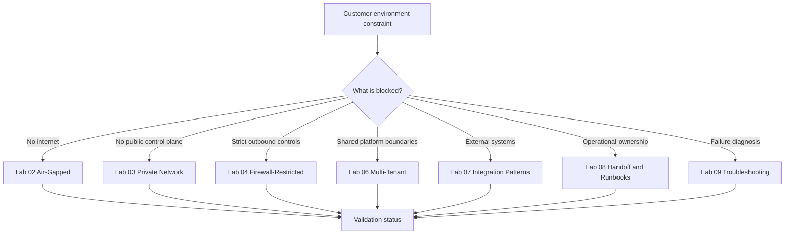
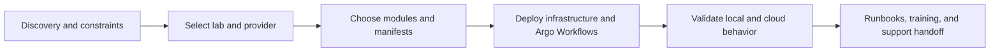
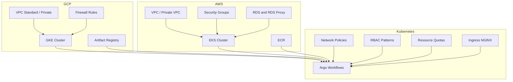
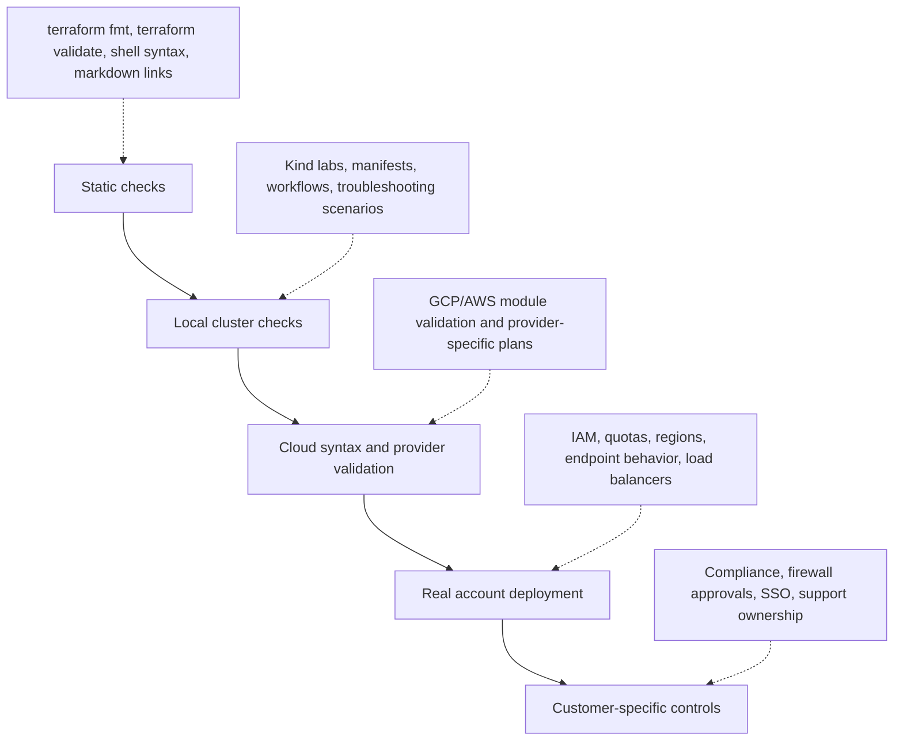
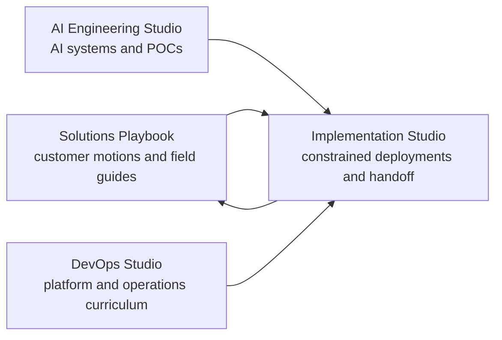

# Visual Diagrams

These diagrams are designed for quick orientation: which path to choose, how the pieces connect, and what evidence to collect before calling a deployment ready.

## Scenario Router

## Implementation Flow

## Module Map

## Validation Ladder

## Series Positioning

