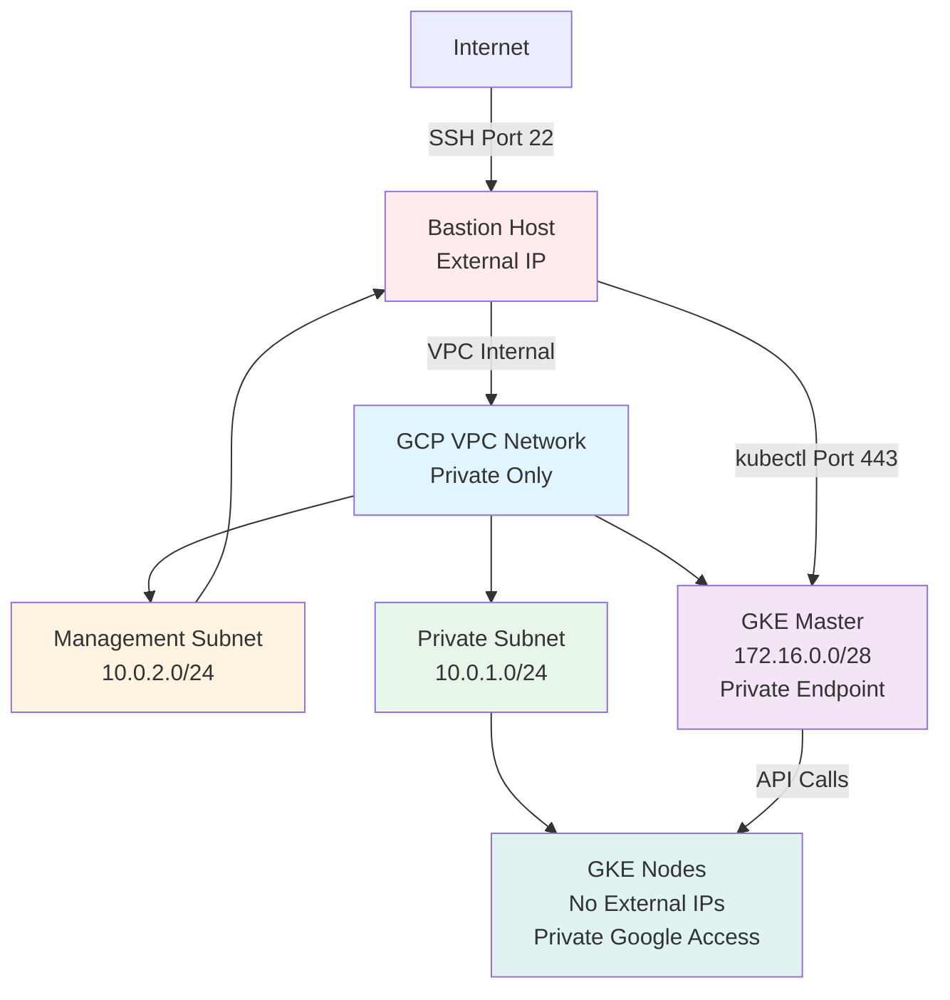
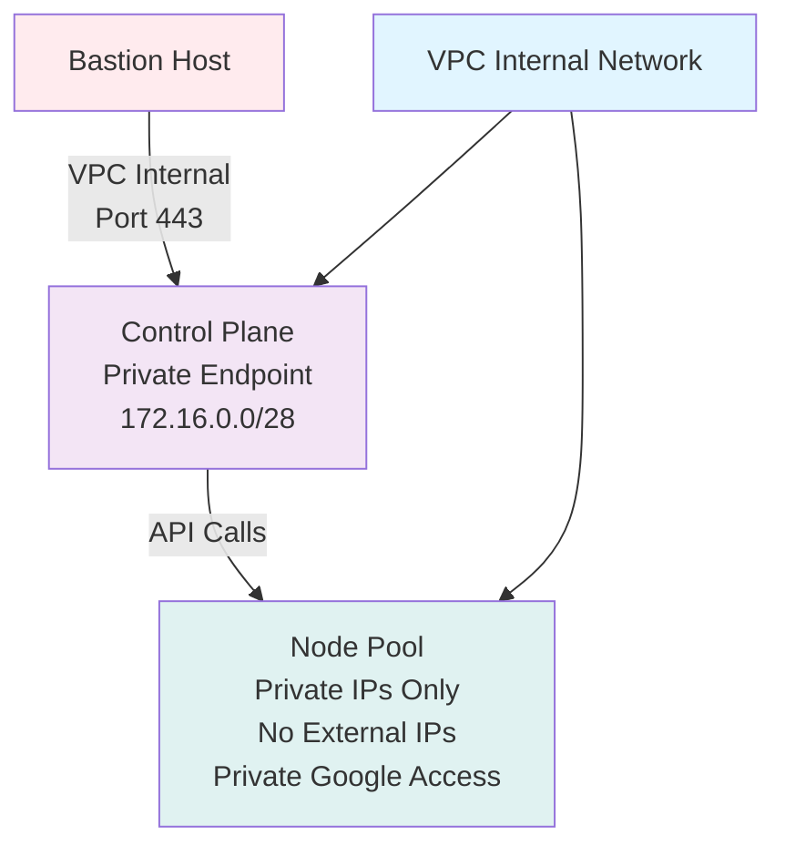
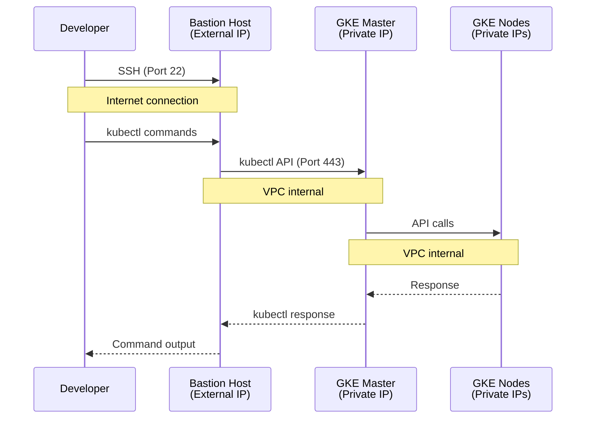
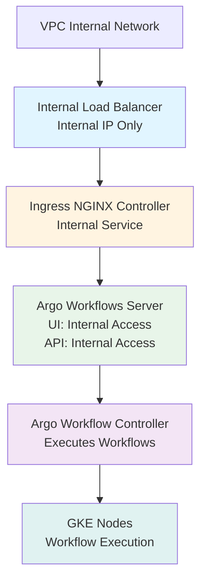

# Lab 03 Architecture

## Overview

Lab 03 deploys a fully private GKE cluster with no public endpoints, accessible only through a bastion host within the VPC.

## Network Architecture

## GKE Cluster Architecture

## Access Flow

## Application Architecture

## Security Architecture

### Network Isolation

- **No Public Subnets**: All resources are in private subnets
- **Private Endpoints**: GKE master only accessible from VPC
- **Firewall Rules**: Restrict access to authorized networks only
- **No NAT**: Nodes use Private Google Access instead

### Access Control

- **Bastion Host**: Single point of entry with external IP
- **SSH Restrictions**: Firewall rules limit SSH to authorized IPs
- **Service Account**: Bastion has minimal required permissions
- **Master Authorized Networks**: Only bastion subnet can access master

### Private Google Access

GKE nodes can access GCP services without external IPs:

- Artifact Registry (pull images)
- Cloud Storage (read/write)
- Cloud Logging (send logs)
- Cloud Monitoring (send metrics)
- Cloud SQL (via private IP)

## Component Details

### VPC Network

- **Type**: Private-only (no public subnets)
- **Subnets**: 
  - Private subnet: GKE nodes
  - Management subnet: Bastion host
- **Routing**: Regional routing mode
- **Private Google Access**: Enabled on private subnet

### GKE Cluster

- **Endpoint**: Private (VPC-only)
- **Nodes**: Private IPs only, no external IPs
- **Master CIDR**: 172.16.0.0/28 (separate from subnets)
- **Authorized Networks**: Management subnet only
- **Network Policy**: Enabled
- **Workload Identity**: Enabled

### Bastion Host

- **Type**: e2-micro (minimal cost)
- **Network**: Management subnet
- **External IP**: Yes (for SSH access)
- **Tools**: Pre-installed kubectl, gcloud, gke-gcloud-auth-plugin
- **Permissions**: container.developer role

### Load Balancer

- **Type**: Internal (GCP Internal Load Balancer)
- **Access**: VPC-only, no external IP
- **Use Case**: Internal services, not internet-facing

## Comparison with Lab 01

| Component | Lab 01 | Lab 03 |
|-----------|--------|--------|
| VPC | Public + Private | Private only |
| GKE Endpoint | Public | Private |
| Node IPs | Private (NAT) | Private (PGA) |
| Access | Direct kubectl | Via bastion |
| Load Balancer | External | Internal |
| NAT Gateway | Yes | No |

## Use Cases

This architecture is suitable for:

- **Compliance Requirements**: Organizations requiring no public endpoints
- **Security Policies**: Strict network isolation requirements
- **Enterprise Environments**: Private-only network designs
- **Regulated Industries**: Financial, healthcare, government
- **Hybrid Cloud**: Connecting to on-premises via VPN/Interconnect

