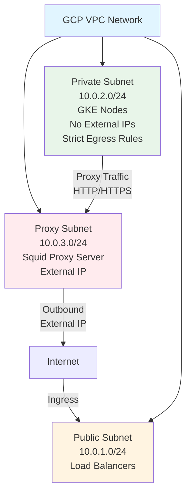
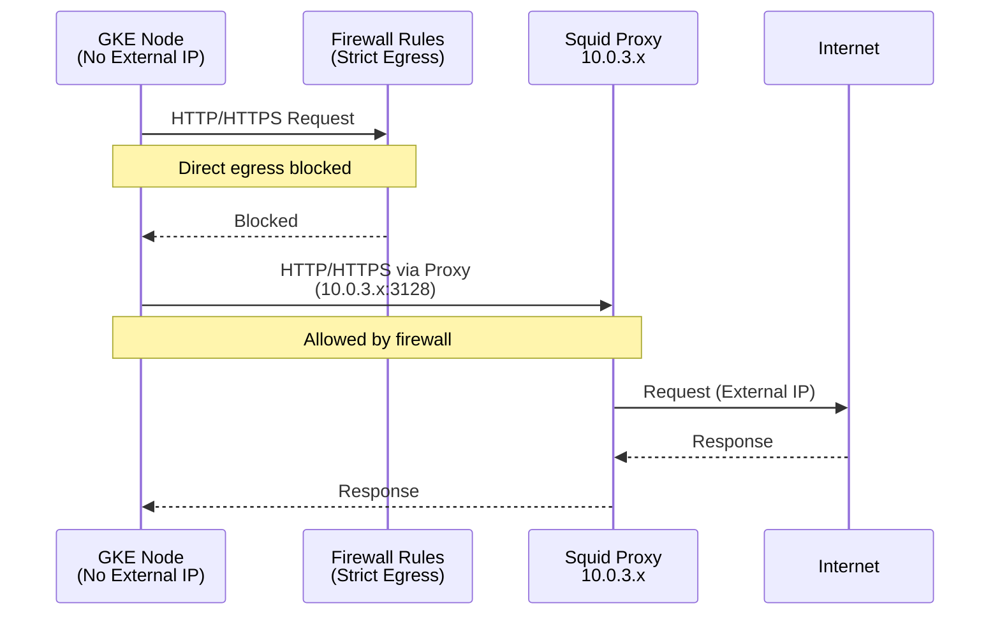
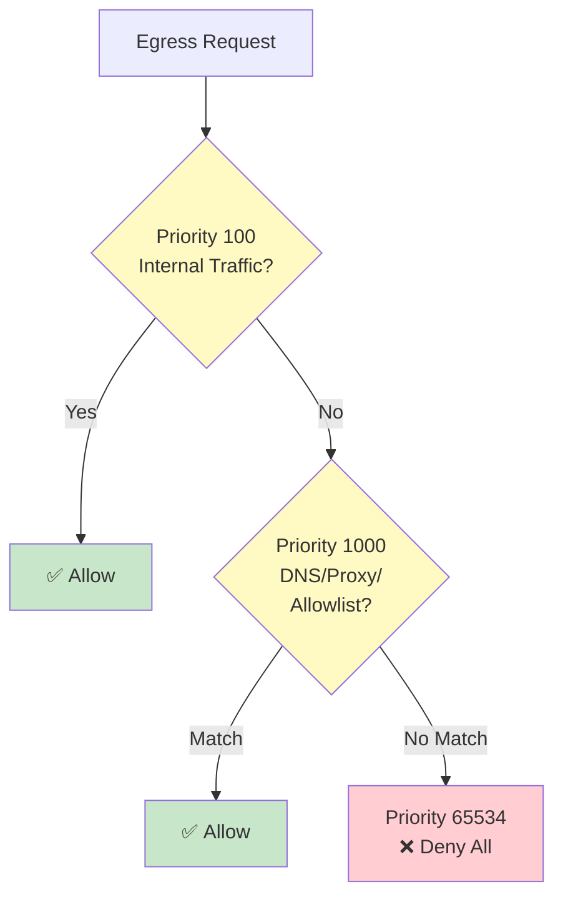
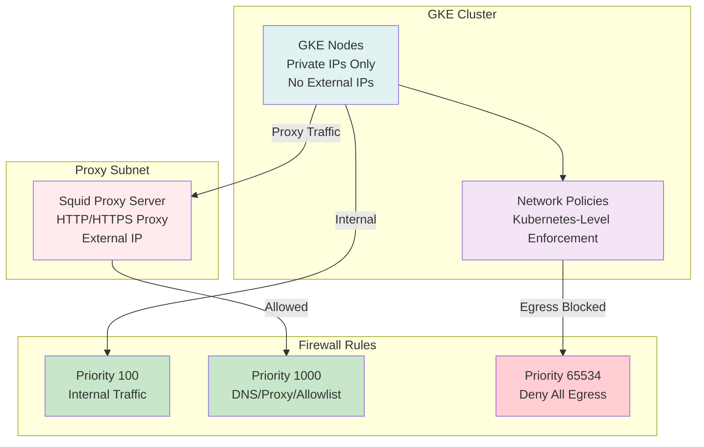

# Lab 04 Architecture

## Overview

Lab 04 deploys a GKE cluster with strict egress firewall rules, using a proxy server for controlled external access.

## Network Architecture



## Egress Flow



## Firewall Rules Architecture

### Rule Priority

1. **Internal Traffic** (priority 100) - Always allowed
2. **DNS** (priority 1000) - Allow to Google DNS
3. **Proxy Access** (priority 1000) - Allow to proxy subnet
4. **External Endpoints** (priority 1000) - Allowlist specific endpoints
5. **Deny All Egress** (priority 65534) - Default deny

### Firewall Rule Flow



## Component Architecture



### GKE Cluster

- **Nodes**: Private IPs only, no external IPs
- **Network Policy**: Enabled for Kubernetes-level enforcement
- **Egress**: Blocked by default, must use proxy

### Proxy Server

- **Type**: Squid HTTP/HTTPS proxy
- **Location**: Dedicated VM in proxy subnet
- **Access**: External IP for outbound internet
- **Configuration**: Allows all traffic (controlled by firewall)

### Network Policies

- **Deny All Egress**: Default policy blocks all egress
- **Allow DNS**: Permits DNS queries
- **Allow Proxy**: Permits traffic to proxy
- **Allow Internal**: Permits cluster-internal traffic

## Application Configuration

### Proxy Environment Variables

All pods are configured with:

```yaml
env:
  - name: HTTP_PROXY
    value: "http://<proxy-ip>:3128"
  - name: HTTPS_PROXY
    value: "http://<proxy-ip>:3128"
  - name: NO_PROXY
    value: "localhost,127.0.0.1,.svc,.svc.cluster.local"
```

### Argo Workflows Configuration

- **Server**: Configured with proxy env vars
- **Controller**: Configured with proxy env vars
- **Workflow Pods**: Inherit proxy via podSpecPatch

## Security Architecture

### Defense in Depth

1. **GCP Firewall Rules**: Network-level enforcement
2. **Kubernetes Network Policies**: Pod-level enforcement
3. **Proxy Server**: Application-level control
4. **Audit Logging**: Monitor all egress traffic

### Access Control

- **Strict Egress**: Deny-all by default
- **Proxy Gateway**: Single point of control
- **Allowlist**: Only approved endpoints
- **Monitoring**: VPC Flow Logs enabled

## Comparison with Other Labs

| Feature | Lab 01 | Lab 03 | Lab 04 |
|---------|--------|--------|--------|
| Egress Control | NAT Gateway | Private Google Access | Strict Firewall + Proxy |
| External Access | Direct | None | Via Proxy |
| Firewall Rules | Standard | None | Strict Deny-All |
| Network Policies | Optional | Optional | Required |
| Proxy | No | No | Yes (Squid) |

## Use Cases

This architecture is suitable for:

- **Compliance Requirements**: Organizations requiring strict egress control
- **Security Policies**: Environments with strict security requirements
- **Audit Requirements**: Need to monitor all external access
- **Customer Environments**: Working with security-conscious customers
- **Regulated Industries**: Financial, healthcare, government

## Monitoring

### VPC Flow Logs

Enable VPC Flow Logs to monitor:
- All egress attempts
- Successful proxy connections
- Blocked direct egress attempts
- Traffic patterns

### Proxy Logs

Squid proxy logs provide:
- All proxied requests
- Source IP addresses
- Destination URLs
- Response codes

## Additional Resources

- [GCP Firewall Rules](https://cloud.google.com/vpc/docs/firewalls)
- [Kubernetes Network Policies](https://kubernetes.io/docs/concepts/services-networking/network-policies/)
- [Squid Proxy](http://www.squid-cache.org/)

