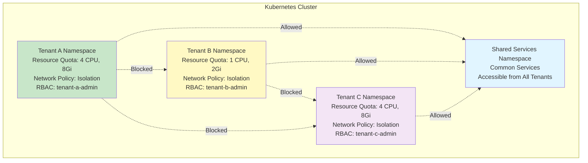
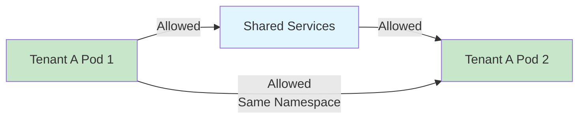
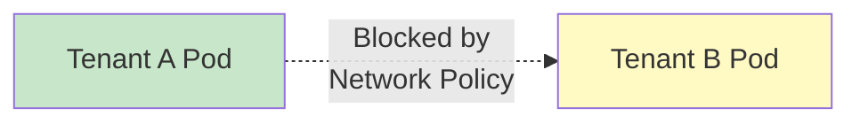
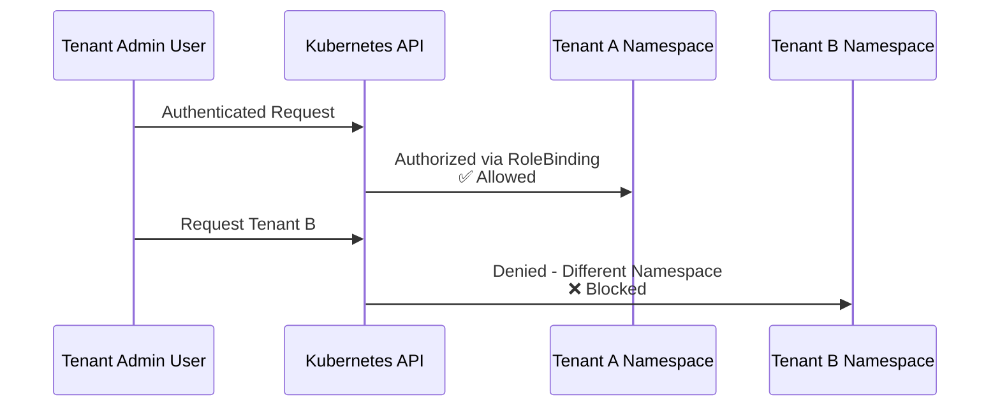
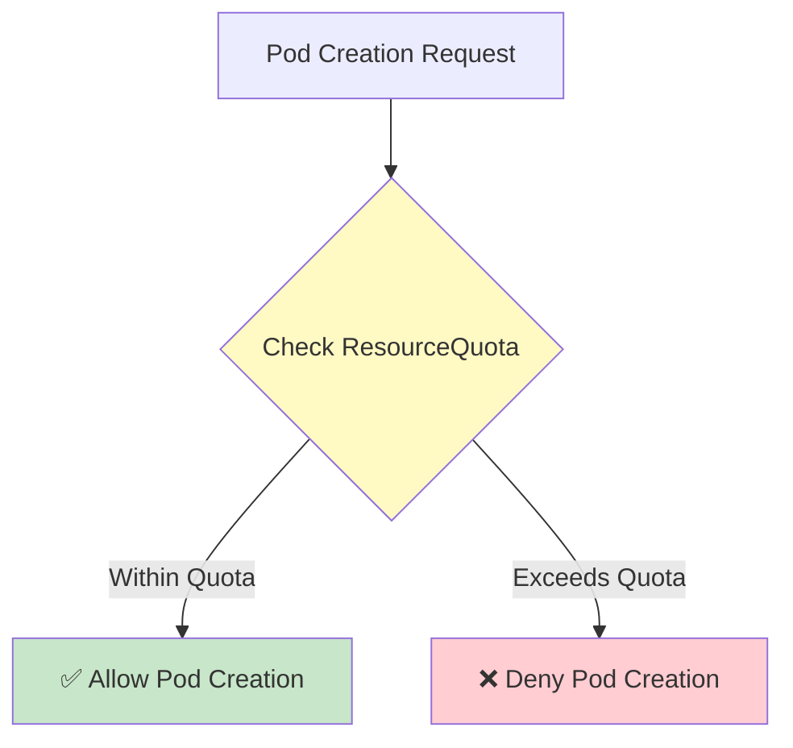

# Lab 06 Architecture

## Overview

Lab 06 demonstrates multi-tenant Kubernetes deployment patterns using namespace-based isolation, RBAC, resource quotas, and network policies. These patterns work on **any Kubernetes cluster** - Kind (local), GCP GKE, or AWS EKS.

## Multi-Tenant Architecture

## Isolation Layers

### Layer 1: Namespace Isolation

**Purpose:** Logical separation of resources

**Implementation:**
- Each tenant gets dedicated namespace
- Namespace labels identify tenant
- Resources scoped to namespace

**Benefits:**
- Clear resource boundaries
- Easy to manage per tenant
- Simple to clean up

### Layer 2: RBAC Isolation

**Purpose:** Access control per tenant

**Implementation:**
- Role scoped to namespace (not ClusterRole)
- RoleBinding grants permissions
- Service accounts per tenant

**Benefits:**
- Tenant admins can't access other tenants
- Fine-grained permissions
- Audit trail per tenant

### Layer 3: Resource Quota Isolation

**Purpose:** Prevent resource exhaustion

**Implementation:**
- ResourceQuota per namespace
- LimitRange for defaults
- Hard limits on CPU, memory, objects

**Benefits:**
- One tenant can't consume all resources
- Predictable resource usage
- Cost allocation per tenant

### Layer 4: Network Policy Isolation

**Purpose:** Network-level separation

**Implementation:**
- NetworkPolicy per namespace
- Deny cross-tenant traffic
- Allow shared services access

**Benefits:**
- Network-level security
- Prevents data leakage
- Enforces isolation

## Component Details

### Shared Services Namespace

**Purpose:** Common services accessible to all tenants

**Examples:**
- Monitoring services
- Logging aggregators
- Shared databases
- API gateways

**Network Policy:**
- Allows ingress from all tenant namespaces
- Allows egress to all tenant namespaces

### Tenant Namespace

**Components:**
- Namespace with tenant label
- ResourceQuota (CPU, memory, objects)
- LimitRange (defaults and constraints)
- NetworkPolicy (isolation rules)
- RBAC Roles and RoleBindings
- Service Accounts

**Isolation:**
- Cannot access other tenant namespaces
- Cannot exceed resource quota
- Cannot modify namespace-level resources (without permission)

## Network Flow

### Allowed Traffic

### Blocked Traffic

## RBAC Flow

### Tenant Admin Access

## Resource Quota Flow

### Resource Request

## Multi-Tenant Patterns

### Pattern 1: Complete Isolation

**Characteristics:**
- No cross-tenant communication
- Separate resource quotas
- Independent RBAC
- Strict network policies

**Use Case:** Maximum security, compliance requirements

### Pattern 2: Shared Services

**Characteristics:**
- Tenants isolated from each other
- Shared services accessible to all
- Common monitoring/logging
- Centralized management

**Use Case:** SaaS platforms, managed services

### Pattern 3: Hierarchical Tenants

**Characteristics:**
- Parent-child tenant relationships
- Shared resources at parent level
- Isolation at child level
- Cross-tenant communication allowed within hierarchy

**Use Case:** Enterprise with departments/divisions

## Security Considerations

### Data Isolation

- Namespace isolation prevents data access
- Network policies prevent network access
- RBAC prevents API access
- Resource quotas prevent resource exhaustion attacks

### Access Control

- Principle of least privilege
- Namespace-scoped roles (not cluster-scoped)
- Regular access reviews
- Audit logging enabled

### Compliance

- Clear tenant boundaries
- Audit trail per tenant
- Resource usage tracking
- Network traffic logging

## Scalability Considerations

### Horizontal Scaling

- Add more tenant namespaces
- Each tenant isolated
- No cross-tenant impact

### Resource Management

- Adjust quotas per tenant
- Monitor quota usage
- Scale quotas as needed

### Performance

- Network policy overhead minimal
- RBAC checks are fast
- Resource quota checks are efficient

## Comparison with Other Approaches

| Approach | Isolation | Complexity | Use Case |
|----------|-----------|------------|----------|
| Namespace-based | High | Low | Most common |
| Cluster per tenant | Very High | High | Maximum isolation |
| Virtual cluster | Very High | Very High | Enterprise scale |

## Additional Resources

- [Kubernetes Multi-Tenancy](https://kubernetes.io/docs/concepts/security/multi-tenancy/)
- [Namespace Best Practices](https://kubernetes.io/docs/concepts/overview/working-with-objects/namespaces/#namespaces-and-dns)
- [Multi-Tenant Security](https://kubernetes.io/docs/concepts/security/pod-security-standards/)

