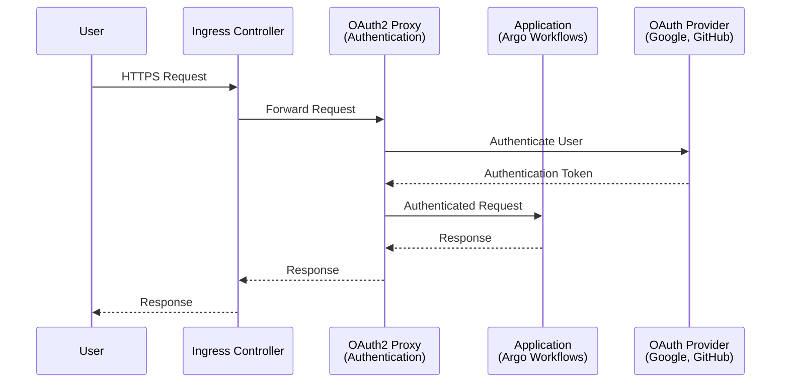
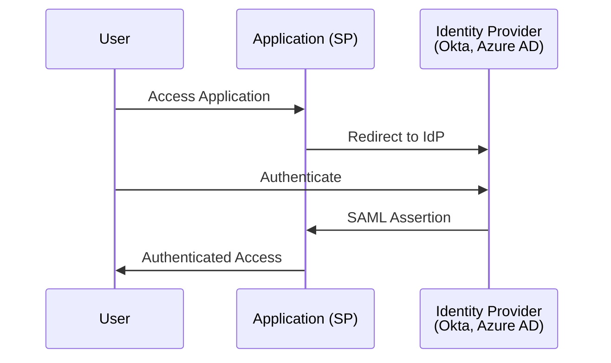
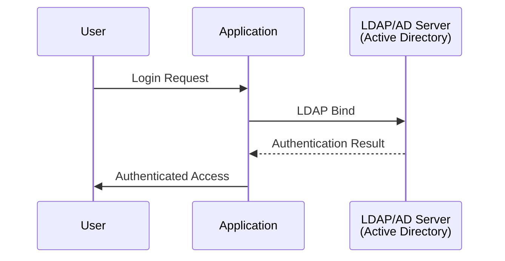
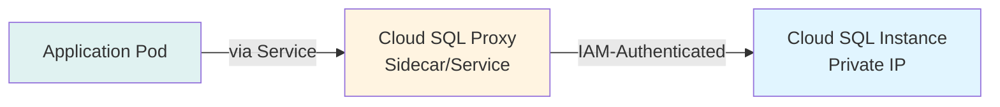
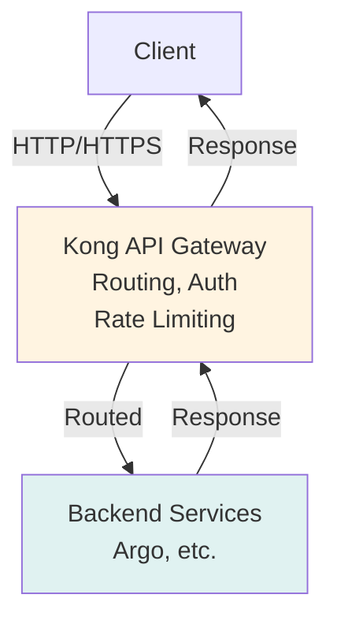
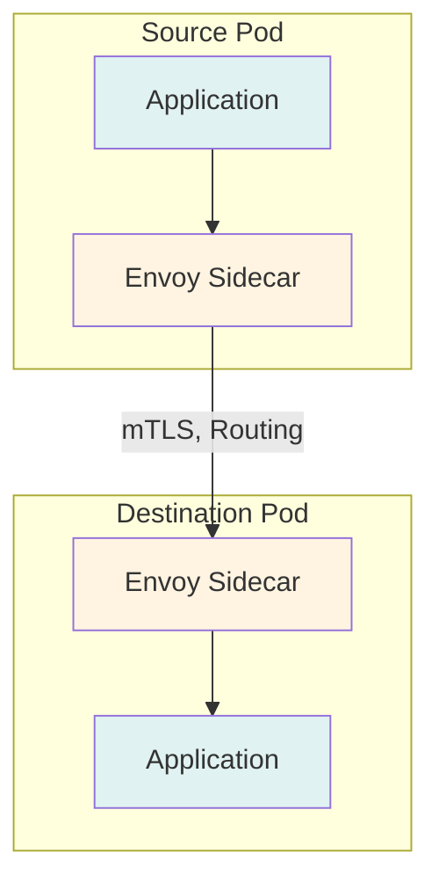

# Integration Patterns Architecture

This document describes the architecture patterns for integrating applications with external systems.

## Overview

Customer deployments often require integration with:
- External authentication systems
- Databases outside the cluster
- API gateways for traffic management
- Service meshes for advanced routing

## Authentication Integration

### OAuth2 Proxy Pattern



**Components:**
- OAuth2 Proxy deployment
- Ingress for external access
- OAuth provider (Google, GitHub, etc.)
- Application (protected by proxy)

### SAML Pattern



**Components:**
- Application as Service Provider (SP)
- Identity Provider (IdP)
- SAML assertions for authentication

### LDAP/AD Pattern



**Components:**
- Application with LDAP client
- LDAP/AD server
- Service account for LDAP queries

## Database Connectivity

### Cloud SQL Proxy Pattern



**Components:**
- Cloud SQL Proxy deployment
- Workload Identity for IAM auth
- Cloud SQL instance with private IP
- Application connecting via proxy

### External Database Pattern

```
┌─────────────────────┐
│  Application Pod    │
└──────┬──────────────┘
       │
       │ (via VPN/Public IP)
       ▼
┌─────────────────────┐
│  VPN Gateway        │
│  (or Direct)        │
└──────┬──────────────┘
       │
       │ (private network)
       ▼
┌─────────────────────┐
│  External Database  │
│  (Customer DC)      │
└─────────────────────┘
```

**Components:**
- VPN connection (Cloud VPN/Interconnect)
- External database
- Application with database client

### Connection Pooling Pattern

```
┌─────────────────────┐
│  Application Pods  │
│  (Multiple)         │
└──────┬──────────────┘
       │
       │ (request connections)
       ▼
┌─────────────────────┐
│  Connection Pooler │
│  (PgBouncer, etc.) │
└──────┬──────────────┘
       │
       │ (reuse connections)
       ▼
┌─────────────────────┐
│  Database           │
└─────────────────────┘
```

**Components:**
- Connection pooler (PgBouncer, ProxySQL)
- Database
- Applications sharing connection pool

## API Gateway

### Kong Pattern



**Components:**
- Kong deployment
- Routes and plugins
- Backend services

### GCP API Gateway Pattern

```
┌─────────────┐
│   Client    │
└──────┬──────┘
       │ HTTPS
       ▼
┌─────────────────────┐
│  GCP API Gateway    │
│  (Managed Service)  │
└──────┬──────────────┘
       │
       │ (routed, authenticated)
       ▼
┌─────────────────────┐
│  Backend Services   │
│  (GKE, Cloud Run)  │
└─────────────────────┘
```

**Components:**
- GCP API Gateway (managed)
- API configuration (OpenAPI)
- Backend services

## Service Mesh

### Istio Pattern



**Components:**
- Istio control plane
- Envoy sidecars per pod
- VirtualServices and DestinationRules
- Policies (mTLS, rate limiting)

## Integration Decision Tree

```
Need Authentication?
├─ Yes → OAuth available?
│   ├─ Yes → OAuth2 Proxy
│   └─ No → SAML/LDAP?
│       ├─ SAML → SAML Integration
│       └─ LDAP → LDAP Integration
└─ No → Skip authentication

Need Database?
├─ Cloud SQL → Cloud SQL Proxy
├─ External (GCP) → VPN + Direct Connection
├─ External (Other) → VPN/Proxy + Connection Pooling
└─ No → Skip database

Need API Gateway?
├─ Managed → GCP API Gateway
├─ Self-Hosted → Kong
└─ No → Skip gateway

Need Advanced Routing?
├─ Yes → Istio Service Mesh
└─ No → Native Kubernetes
```

## Security Considerations

### Authentication
- Use HTTPS/TLS for all authentication flows
- Store secrets in Kubernetes Secrets
- Validate tokens/assertions properly
- Implement session management

### Database
- Use private IPs when possible
- Enable SSL/TLS for database connections
- Use IAM authentication (Cloud SQL)
- Implement connection pooling
- Monitor connection attempts

### API Gateway
- Enable authentication on gateway
- Use rate limiting
- Log all requests
- Monitor for abuse

### Service Mesh
- Enable mTLS for service-to-service
- Implement network policies
- Monitor traffic patterns
- Use authentication policies

## Performance Considerations

### Database
- Connection pooling reduces overhead
- Monitor connection pool metrics
- Tune pool size based on workload
- Use read replicas for read-heavy workloads

### API Gateway
- Cache responses when possible
- Use CDN for static content
- Monitor gateway latency
- Scale gateway based on traffic

### Service Mesh
- Sidecar adds latency (minimal)
- Monitor Envoy metrics
- Use appropriate routing policies
- Consider mesh overhead

## Monitoring

### Key Metrics

**Authentication:**
- Authentication success/failure rates
- Token validation times
- Session duration

**Database:**
- Connection pool usage
- Query latency
- Connection errors
- Database CPU/memory

**API Gateway:**
- Request rate
- Response latency
- Error rates
- Rate limit hits

**Service Mesh:**
- Request rate per service
- Latency percentiles
- Error rates
- mTLS handshake failures

## Troubleshooting

See [Troubleshooting Guide](./troubleshooting.md) for common issues and solutions.

