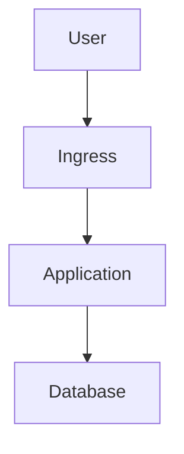

# Documentation Standards

**Application:** [Application Name]  
**Purpose:** Define documentation standards for operational readiness

## Overview

This document defines standards for creating and maintaining operational documentation. High-quality documentation is essential for customer empowerment and successful operations.

## Documentation Principles

### 1. Clarity

**Guidelines:**
- Use clear, concise language
- Avoid jargon when possible
- Define technical terms
- Use examples
- Include screenshots/diagrams

**Example:**
❌ "Execute the deployment procedure."
✅ "Run `kubectl apply -f deployment.yaml` to deploy the application."

### 2. Completeness

**Guidelines:**
- Include all necessary steps
- Don't assume prior knowledge
- Include prerequisites
- Include verification steps
- Include troubleshooting

**Example:**
❌ "Deploy the application."
✅ "1. Verify cluster access: `kubectl cluster-info`
   2. Apply deployment: `kubectl apply -f deployment.yaml`
   3. Verify deployment: `kubectl get pods`
   4. Check logs: `kubectl logs deployment/app`"

### 3. Accuracy

**Guidelines:**
- Test all procedures
- Verify all commands
- Update when system changes
- Review regularly
- Version control

**Example:**
- Test runbooks before handoff
- Verify commands work in target environment
- Update when configuration changes

### 4. Accessibility

**Guidelines:**
- Organize logically
- Use consistent structure
- Include table of contents
- Make searchable
- Version control

**Example:**
- Use consistent headings
- Include navigation
- Use markdown for version control
- Make searchable

## Documentation Types

### 1. Architecture Documentation

**Purpose:** Explain system design and components

**Required Sections:**
- System overview
- Component descriptions
- Data flow diagrams
- Integration points
- Infrastructure components

**Format:**
- Markdown with diagrams
- Architecture diagrams (Mermaid, PlantUML)
- Component descriptions
- Integration documentation

### 2. Runbooks

**Purpose:** Step-by-step operational procedures

**Required Sections:**
- Overview
- Prerequisites
- Step-by-step procedures
- Verification steps
- Troubleshooting
- Rollback procedures

**Format:**
- Markdown
- Numbered steps
- Code blocks for commands
- Checklists
- Examples

### 3. Troubleshooting Guides

**Purpose:** Help resolve common issues

**Required Sections:**
- Common issues
- Symptoms
- Investigation steps
- Resolution steps
- Prevention

**Format:**
- Markdown
- Problem-solution format
- Code examples
- Diagnostic commands

### 4. API Documentation

**Purpose:** Document APIs (if applicable)

**Required Sections:**
- API overview
- Endpoints
- Request/response formats
- Authentication
- Examples

**Format:**
- OpenAPI/Swagger
- Markdown
- Code examples
- Interactive documentation

## Documentation Structure

### Standard Structure

```markdown
# Document Title

## Overview
Brief description of document purpose

## Prerequisites
What's needed before starting

## Procedures
Step-by-step instructions

## Verification
How to verify success

## Troubleshooting
Common issues and solutions

## Related Documentation
Links to related docs
```

### Runbook Structure

```markdown
# Runbook Title

## Overview
What this runbook covers

## Prerequisites
- Required access
- Required information
- Pre-requisite steps

## Procedures
### Step 1: [Title]
Description and commands

### Step 2: [Title]
Description and commands

## Verification
How to verify success

## Rollback
How to rollback if needed

## Troubleshooting
Common issues

## Related Documentation
Links
```

## Documentation Best Practices

### Writing Style

**Guidelines:**
- Use active voice
- Use imperative mood for commands
- Be specific
- Use examples
- Include context

**Examples:**
- ✅ "Run `kubectl get pods` to list pods"
- ❌ "Pods can be listed"
- ✅ "Scale the deployment to 5 replicas"
- ❌ "The deployment should be scaled"

### Code Examples

**Guidelines:**
- Use code blocks
- Include expected output
- Show error handling
- Include comments
- Test all examples

**Example:**
```bash
# List pods in namespace
kubectl get pods -n production

# Expected output:
# NAME                    READY   STATUS    RESTARTS   AGE
# app-7d4b8f9c6-abc123    1/1     Running   0          5m
```

### Diagrams

**Guidelines:**
- Use standard tools (Mermaid, PlantUML)
- Keep diagrams simple
- Include legends
- Update when architecture changes
- Version control diagrams

**Example:**


### Checklists

**Guidelines:**
- Use checkboxes
- Group related items
- Include verification
- Make actionable
- Update regularly

**Example:**
- [ ] Verify cluster access
- [ ] Check pod status
- [ ] Verify health endpoint
- [ ] Review metrics

## Documentation Maintenance

### Update Triggers

**Update When:**
- System configuration changes
- Procedures change
- New issues discovered
- Customer feedback received
- Regular review (quarterly)

### Review Process

**Regular Reviews:**
- **Monthly:** Quick review
- **Quarterly:** Comprehensive review
- **After Changes:** Immediate update
- **After Incidents:** Update based on lessons learned

### Version Control

**Guidelines:**
- Use version control (Git)
- Tag versions
- Document changes
- Maintain changelog
- Archive old versions

## Documentation Quality Checklist

### Content Quality

- [ ] Clear and concise
- [ ] Complete and accurate
- [ ] Well-organized
- [ ] Examples provided
- [ ] Screenshots/diagrams included

### Technical Quality

- [ ] Commands tested
- [ ] Procedures verified
- [ ] Links work
- [ ] Code examples work
- [ ] Diagrams accurate

### Usability

- [ ] Easy to find
- [ ] Easy to navigate
- [ ] Easy to understand
- [ ] Searchable
- [ ] Accessible

## Documentation Tools

### Recommended Tools

**Markdown:**
- Standard format
- Version control friendly
- Easy to convert
- Widely supported

**Diagram Tools:**
- Mermaid (text-based)
- PlantUML (text-based)
- Draw.io (visual)

**Documentation Platforms:**
- GitHub/GitLab (markdown)
- Confluence (wiki)
- Notion (wiki)
- Custom documentation site

## Related Documentation

- [What Production-Ready Means](./what-production-ready-means.md)
- [Handoff Checklist](./handoff-checklist.md)

---

**Remember:** Good documentation is not just about completeness—it's about empowering the reader to succeed independently.

